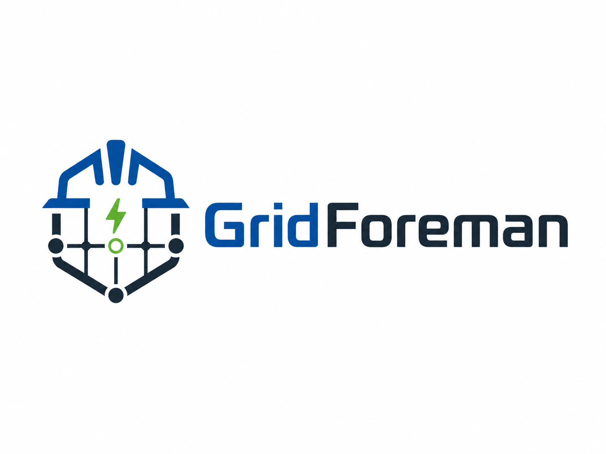

# GridForeman

**GridForeman** is an open-source software platform for managing electric vehicle charging infrastructure with a strong focus on local load management, RFID-based authorization, OCPP integration, metering, and optional centralized reporting.

The goal of GridForeman is to provide a reliable and flexible system for professional EV charging installations such as company parking areas, apartment buildings, hotels, fleets, and multi-site infrastructures.

GridForeman is designed around a simple principle:

> **Each site must remain autonomous, while the central system handles supervision, reporting, and long-term data storage.**

In practice, this means:

> **GridForeman Site must work fully on its own. GridForeman Central is optional.**

## Overview

GridForeman can be deployed in two ways:

```text
1. Standalone
Charging Stations  →  GridForeman Site
                       local controller

2. Federated
Charging Stations  →  GridForeman Site  →  GridForeman Central
                       local controller     optional federation
```

### GridForeman Site

A **GridForeman Site** instance runs locally at each installation where charging stations are installed.

It acts as the local OCPP backend for the charging stations and manages all real-time and safety-critical functions, including:

* OCPP communication with charging stations
* RFID authorization
* local transaction management
* dynamic load management
* site power monitoring
* local metering storage
* offline operation
* local diagnostics and event logging
* local reporting and exports
* optional store-and-forward synchronization with a central server

This ensures that the charging infrastructure can continue to operate even if the Internet connection is unavailable or if no central server is configured at all.

### GridForeman Central

**GridForeman Central** is an optional component that collects and manages data from multiple sites.

It is responsible for:

* long-term storage of charging sessions
* centralized reporting
* user and RFID management
* multi-site dashboards
* configuration management
* billing and cost allocation support
* historical metering data
* operational monitoring

The central system does not need to directly control every charging station in real time. Instead, it supervises and coordinates local GridForeman Site instances when federation is required.

## Key Features

### OCPP Support

GridForeman is designed to communicate with charging stations using OCPP.

Initial focus:

* OCPP 1.6J
* WebSocket communication
* BootNotification
* Heartbeat
* StatusNotification
* Authorize
* StartTransaction
* MeterValues
* StopTransaction
* RemoteStartTransaction
* RemoteStopTransaction
* Smart Charging profiles

### RFID Authorization

GridForeman supports RFID-based user authorization.

RFID cards or tags can be managed locally at each site. When GridForeman Central is used, RFID data can also be synchronized across sites. Each site keeps a local authorization dataset, allowing charging to continue even when the network is unavailable.

Typical authorization flow:

```text
RFID presented
→ charging station sends Authorize request
→ GridForeman Site checks local authorization cache
→ transaction is accepted or rejected
```

### Dynamic Load Management

GridForeman Site manages the available electrical capacity of the installation.

The local load manager can use:

* site power meter readings
* building consumption
* configured grid limit
* active charging sessions
* connector status
* user priorities
* minimum current requirements
* phase usage

Based on this information, GridForeman dynamically distributes the available current between active charging stations.

The objective is to:

* avoid tripping the main breaker
* maximize available charging power
* keep charging fair between users
* support priority-based charging
* maintain operation even without Internet access

### Local Autonomy

Each GridForeman Site is designed to operate independently.

If the connection to GridForeman Central is lost, or if no central server is used, the site can continue to:

* authorize known RFID cards
* start and stop charging sessions
* collect meter values
* apply load management
* store charging data locally

When a central server is configured and the connection is restored, the local site can synchronize pending events and transactions upstream.

### Store-and-Forward Synchronization

All relevant events are stored locally. When GridForeman Central is enabled, they can also be forwarded upstream.

This includes:

* charging sessions
* meter values
* status changes
* RFID authorization attempts
* errors and alarms
* OCPP events
* load management decisions

The synchronization mechanism is designed to be idempotent, so retransmitted events do not create duplicated data in the central system.

### Metering and Reporting

GridForeman Site stores local historical charging data and provides reporting capabilities on its own. When present, GridForeman Central can aggregate historical data from multiple sites and provide fleet-level reporting.

Possible reports include:

* charging sessions by user
* energy consumption by site
* energy consumption by charging station
* monthly summaries
* RFID usage
* cost allocation
* exported CSV/PDF reports
* operational statistics

## Typical Use Cases

GridForeman is suitable for:

* company EV charging
* residential buildings
* hotels
* private and semi-public parking areas
* fleet charging
* multi-site installations
* installations with limited grid capacity
* infrastructures requiring local load management

## Architecture

### Standalone site

The simplest deployment contains one autonomous GridForeman Site per physical installation.

```text
┌────────────────┐
│ GridForeman    │
│ Site           │
│                │
│ - OCPP server  │
│ - load manager │
│ - RFID store   │
│ - local DB     │
│ - local UI     │
│ - reporting    │
└───────▲────────┘
        │
     OCPP 1.6J
        │
┌───────┴────────┐
│ Charging       │
│ Stations       │
└────────────────┘
```

### Federated sites
When multi-site supervision is needed, a central instance can be added on top.

```text
                   ┌────────────────────────┐
                   │   GridForeman Central  │
                   │                        │
                   │ - reporting            │
                   │ - user management      │
                   │ - RFID management      │
                   │ - historical data      │
                   │ - site configuration   │
                   └───────────▲────────────┘
                               │
                     optional synchronization
                               │
        ┌──────────────────────┴──────────────────────┐
        │                                             │
┌───────┴────────┐                           ┌────────┴───────┐
│ GridForeman    │                           │ GridForeman    │
│ Site A         │                           │ Site B         │
│                │                           │                │
│ - OCPP server  │                           │ - OCPP server  │
│ - load manager │                           │ - load manager │
│ - RFID cache   │                           │ - RFID cache   │
│ - local DB     │                           │ - local DB     │
└───────▲────────┘                           └────────▲───────┘
        │                                             │
     OCPP 1.6J                                    OCPP 1.6J
        │                                             │
┌───────┴────────┐                           ┌────────┴───────┐
│ Charging       │                           │ Charging       │
│ Stations       │                           │ Stations       │
└────────────────┘                           └────────────────┘
```

## Design Goals

GridForeman is designed with the following goals:

* local-first operation
* standalone operation without mandatory cloud or central server
* reliable load management
* simple OCPP integration
* vendor-independent architecture
* optional centralized reporting
* offline tolerance
* scalable multi-site deployment
* clear separation between real-time site control and central supervision

## Business Model

GridForeman is open-source software.

The project is not based on license fees. Its value comes from professional installation, configuration, integration and support services.

GridForeman is designed to be used by electricians, system integrators and EV charging professionals who need a reliable, vendor-independent platform for managing charging infrastructure.

Commercial use, professional installation and paid support services are explicitly welcome.

Typical professional services around GridForeman may include:

* installation and commissioning
* charging station integration
* OCPP configuration
* RFID setup
* site-specific load management configuration
* power meter integration
* reporting customization
* central hosting
* backup and maintenance
* software updates
* technical support

## Project Status

GridForeman is currently under development.

The first development phase focuses on:

* OCPP 1.6J backend implementation
* RFID authorization
* charging session storage
* local transaction management
* MeterValues collection
* dynamic load management
* site-to-central synchronization
* reporting data model

## License

GridForeman is licensed under the **Apache License 2.0**.

This means that the software can be used, modified, distributed and integrated into commercial solutions, provided that the license terms are respected.

See the [`LICENSE`](LICENSE) file for details.

## Trademark Notice

The GridForeman name and logo are part of the identity of the project.

The source code is open source, but the name **GridForeman** and the GridForeman logo should not be used to represent modified, unrelated or incompatible versions of the software without permission from the project maintainers.

This helps protect users and professionals from confusion and ensures that the GridForeman name remains associated with reliable and compatible implementations.
